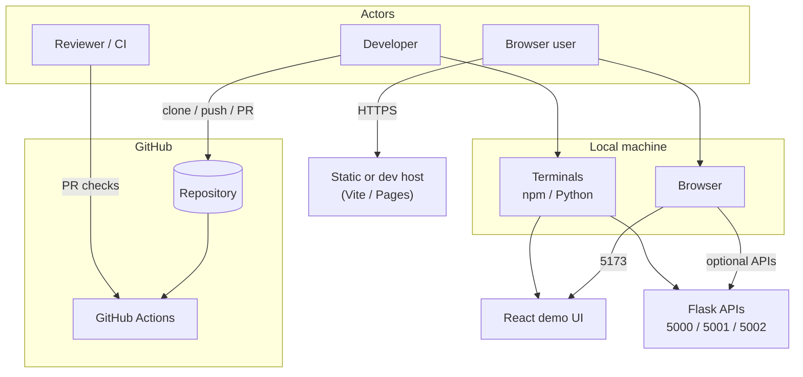
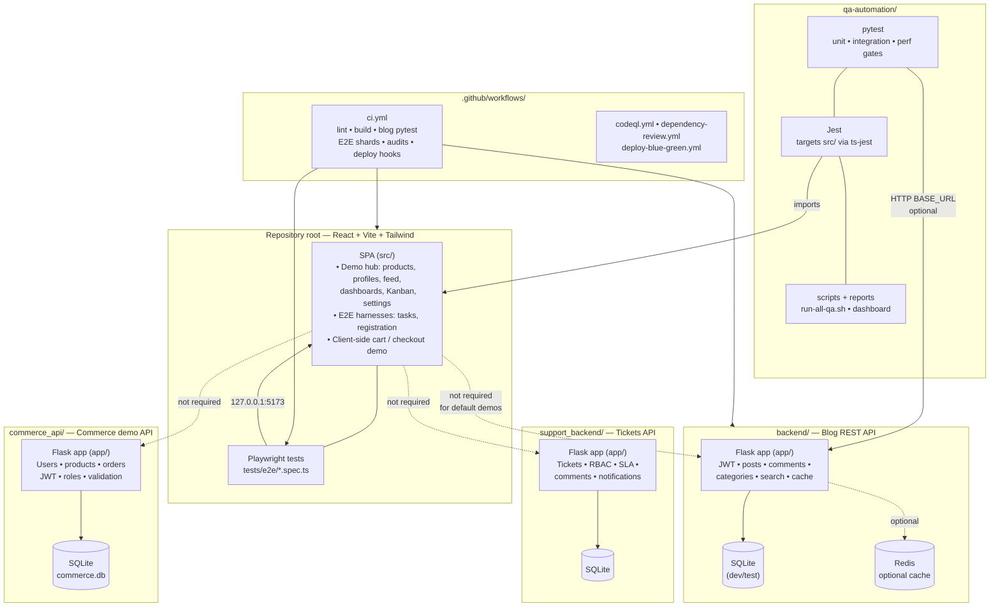
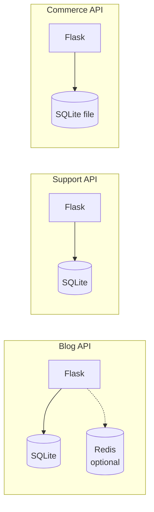
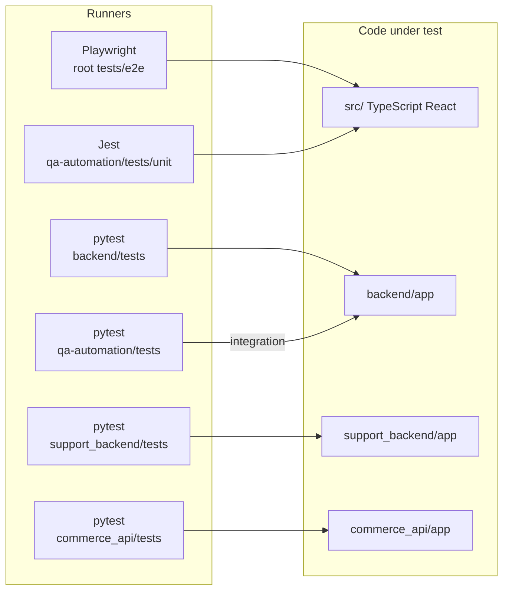
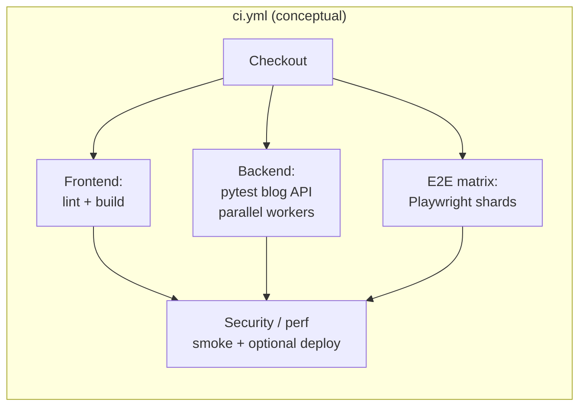

# Architecture — Cursor AI in-house course (module 8)

This document describes how the **workshop monorepo** is structured: runnable pieces, how they relate in development and CI, and where data lives. Diagrams use [Mermaid](https://mermaid.js.org/); GitHub and many editors render them in preview. **PNG/SVG exports:** see [§6](#6-exporting-diagrams-png--svg) and [`diagrams/README.md`](diagrams/README.md).

---

## 1. System context

Who interacts with what at a high level.

---

## 2. Monorepo — logical architecture (main diagram)

The repository is **not** a single deployed product: it bundles **one SPA** and **three independent Flask services**, plus **QA tooling** and **CI workflows**. The default UI demos use **in-browser state and fixtures**; wiring the UI to a given API is optional for course exercises.

### Default ports (development)

| Runnable | Port | Notes |
|----------|------|--------|
| Vite dev server (`npm run dev`) | **5173** | Primary UI entry |
| Blog API (`backend/run.py`) | **5000** | Swagger `/apidocs/` |
| Support API (`support_backend/run.py`) | **5001** | Swagger `/apidocs/` |
| Commerce API (`commerce_api/run.py`) | **5002** | REST + health routes |

Each Python service uses its **own virtual environment** and **`requirements.txt`**.

---

## 3. Data and external dependencies

- **Persistence:** SQLAlchemy-backed **SQLite** per service for local and typical test configs.  
- **Blog caching:** Optional **Redis**; tests can use **fakeredis** without a live Redis process.  
- **Secrets:** `.env` / `.env.example` per service (never commit real secrets).

---

## 4. QA and test layers (how quality tools attach)

- **Playwright:** drives the **browser** against the Vite app; does not produce Python line coverage.  
- **pytest:** each API has its own suite; **Coverage.py** enforces thresholds on `app/` where configured (`backend` ≥85%, `support_backend` ≥80%).  
- **QA `pytest`:** includes optional **live HTTP** checks against the blog API (`BASE_URL`).  
- **Jest:** small unit footprint over **`src/`** modules referenced from `qa-automation` (see `jest.config.cjs`).

---

## 5. CI pipeline (simplified)

`ci.yml` orchestrates parallel stages; exact steps evolve with the workflow file.

Additional workflows: **CodeQL** on selected paths, **dependency review** on PRs, **blue-green deploy** template for manual promotion.

---

## 6. Exporting diagrams (PNG / SVG)

Diagrams in this file are plain Mermaid fenced blocks. The repository includes a small exporter that splits them into `.mmd` files and invokes [**@mermaid-js/mermaid-cli**](https://github.com/mermaid-js/mermaid-cli) (`mmdc`).

**From the repository root** (after `npm install`):

| Command | Result |
|---------|--------|
| `npm run diagrams:export` | Writes **SVG** under `docs/diagrams/svg/` and **PNG** under `docs/diagrams/png/`, plus intermediate `.mmd` under `docs/diagrams/build/`. |
| `npm run diagrams:export:svg` | SVG only. |
| `npm run diagrams:export:png` | PNG only. |

**Outputs** use stable basenames: `01-system-context`, `02-monorepo-logical-architecture`, `03-data-dependencies`, `04-qa-test-layers`, `05-ci-pipeline` (same order as the Mermaid blocks above). If you add or reorder diagrams, update `SLUGS` in [`scripts/export-mermaid-diagrams.mjs`](../scripts/export-mermaid-diagrams.mjs).

**Notes**

- The first run may **download Chromium** for headless rendering (large download). CI machines should cache `~/.cache/puppeteer` when applicable.
- Generated `svg/`, `png/`, and `build/` are **gitignored** by default; see [`diagrams/README.md`](diagrams/README.md) for Docker and vendoring options.

---

## 7. Related documents

| Document | Purpose |
|----------|---------|
| [README.md](../README.md) | Setup, run commands, project list |
| [TEST_COVERAGE_REPORT.md](TEST_COVERAGE_REPORT.md) | Coverage numbers and reproduction |
| [CI_CD_OPTIMIZATION.md](CI_CD_OPTIMIZATION.md) | Pipeline tuning |
| [CI_PIPELINE_PERFORMANCE.md](CI_PIPELINE_PERFORMANCE.md) | Timing analysis |
| [qa-automation/docs/QA-RUNBOOK.md](../qa-automation/docs/QA-RUNBOOK.md) | Full QA automation |
| [`diagrams/README.md`](diagrams/README.md) | Diagram export commands and Docker tip |

---

*Diagrams describe intent and major boundaries; for exact job names and steps, prefer the YAML under `.github/workflows/` and each service’s `README.md`.*
